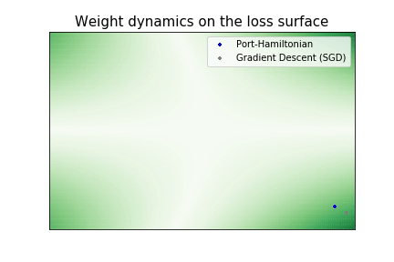

# PortHamiltonianNN

> A new framework for learning in which the neural network parameters are solutions of ODEs. By viewing the optimization process as the evolution of a port-Hamiltonian system we can ensure convergence to a minimum of the objective function. 

This method is applicable to any generic neural network architecture. The neural network is coupled to a fictitious Port-Hamiltonian system whose states are given by the neural network parameters. The energy of the Port-Hamiltonian system is then linked to the objective function and automatically minimized due to the PH [passivity](https://en.wikipedia.org/wiki/Passivity_(engineering)) property.

<p align="center"> 

</p>

Code for "Port-Hamiltonian Approach to Neural Network Training" submitted to 58th IEEE Conference on Decision and Control (CDC 2019). arXiv preprint available [here](https://arxiv.org/abs/1909.02702).


### Content:

```pyPH/numpy_simple.py``` contains a numpy implementation of a single linear predictor along with functions that describe the Port-Hamiltonian ODE of its parameters. For general use import the PHNN class in ```pyPH/model.py``` instead.

```pyPH/phnn.py``` contains the new optimizer class proposed in the paper. The class take as input PyTorch torch.nn.Modules and provides a fit method to optimize them as Port-Hamiltonian Neural Networks.


